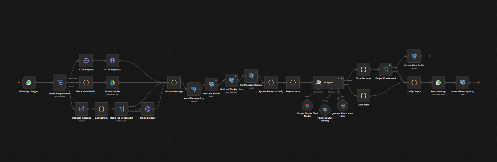
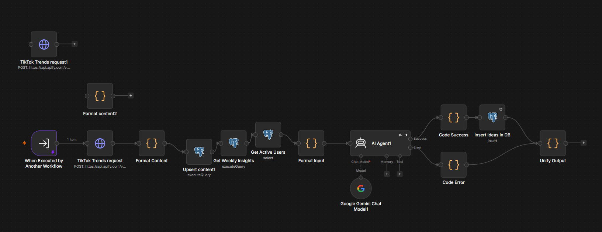
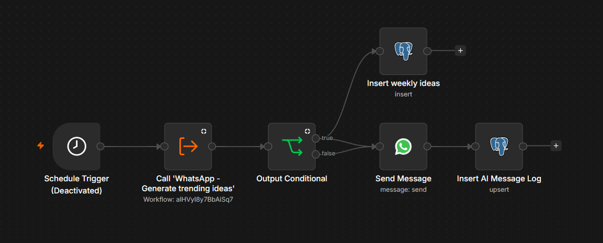

# Whatsapp Chatbot - Content Strategy AI Assistant

> **Trabajo de Fin de Máster (TFM)**  
> **Autor:** Ferran Borrás Bolinches  
> **Stack:** n8n | Google Gemini API | Supabase (PostgreSQL) | Apify | Meta Graph API (WhatsApp)

---

## 📋 Descripción del Proyecto

Sistema multi-agente en **n8n** diseñado para automatizar la estrategia y planificación de contenido de creadores y productores musicales. El sistema combina scraping de tendencias en redes sociales (**TikTok/Reels** vía Apify), un pipeline **RAG** alimentado por **Google Gemini** sobre **Supabase**, y una interfaz conversacional directa por **WhatsApp**.

El objetivo es actuar como un **coach de contenido automatizado**, permitiendo al artista actualizar su perfil, recibir un plan de ideas semanales personalizado (con ganchos, conceptos de vídeo, audios virales y mejores franjas de publicación) o solicitar revisiones de estrategia en tiempo real.

---

## Arquitectura del Sistema

El proyecto está estructurado de forma modular en dos flujos interconectados de n8n más un disparador programado:

1. **Flujo Principal - Agente Conversacional (`01_conversational_agent.json`):**
   - Gestiona el webhook de entrada de WhatsApp (Meta Graph API v20.0).
   - Utiliza un agente de IA con prompts del sistema estructurados para interpretar la intención del usuario (actualizar perfil, consultar estado, solicitar ideas).
   - Llama a subworkflows mediante la herramienta `Execute Workflow Tool`.
   - Registra las interacciones en la base de datos y formatea las respuestas para WhatsApp.

   

2. **Subworkflow de Tendencias e Ideas (`02_weekly_ideas_subworkflow.json`):**
   - Dispara el actor de scraping en Apify para extraer métricas de TikTok y Reels sobre música y producción.
   - Almacena y actualiza el corpus de datos en la tabla `tiktok_trends` de Supabase.
   - Ejecuta la función PL/pgSQL `get_weekly_insights()` para recuperar agregaciones analíticas (hashtags con mayor tasa de crecimiento, franjas horarias con más visibilidad y TOP vídeos con mayor _growth score_).
   - Procesa la información mediante **Gemini 3.5 Flash** para generar el feedback, análisis multimodal y las propuestas de contenido estructuradas.

   

3. **Disparador Programado (`03_scheduled_trigger.json`):**
   - Cronjob semanal que automatiza la generación y distribución proactiva del informe para los usuarios suscritos (`weekly_reports_opt_in: true`).

   

---

## 📁 Estructura del Repositorio

```
.
├── README.md # Documentación principal del proyecto
│
├── database/ # Esquema y scripts de PostgreSQL / Supabase
│ ├── functions/
│ │ ├── get_weekly_insights.sql # Función PL/pgSQL para la agregación del RAG
│ │ └── backup_managment.sql # Restauración automática de backups
│ │
│ ├── tables/
│ │ ├── users.sql # Perfiles de los creadores
│ │ ├── tiktok_trends.sql # Dataset de tendencias y métricas de vídeo
│ │ ├── chat_messages.sql # Histórico de interacciones por WhatsApp
│ │ ├── weekly_ideas.sql # Histórico de ideas generadas y enviadas
│ │ └── whatsapp_logs.sql # Métricas de ejecución y control de errores
│ │
│ └── data/ # Datos de las tablas
│ ├── chat_messages_rows.csv
│ ├── users_rows.csv
│ ├── weekly_ideas_rows.csv
│ ├── whatsapp_logs_rows.csv
│ └── tiktok_trends_rows.csv
│
├── workflows/ # Flujos exportados de n8n en formato JSON
│ ├── 01_conversational_agent.json
│ ├── 02_weekly_ideas_subworkflow.json
│ └── 03_scheduled_trigger.json
│
└── docs/ # Documentación complementaria
```

---

## 📊 Base de Datos y Funciones PL/pgSQL

El proyecto utiliza una base de datos PostgreSQL alojada en Supabase optimizada para consultas analíticas y almacenamiento del corpus RAG.

### 1. Función RAG: `get_weekly_insights()`

Calcula las agregaciones analíticas de la tabla `tiktok_trends`:

- **`top_hashtags`**: Desanida las etiquetas JSONB y calcula volumen y crecimiento promedio (`growth_score`).
- **`top_time_slots`**: Agrupa publicaciones por día de la semana y franja horaria óptima a partir de `created_at_local`.
- **`top_videos`**: Selecciona las publicaciones con mayor puntuación de impacto para inyectar como contexto visual/narrativo en Gemini.

### 2. Recuperación de copias de seguridad: `restore_all_tables_from_backup()`

Permite restaurar de forma automática todas las tablas vivas desde sus correspondientes tablas `_backup` manteniendo la integridad de las claves primarias:

SELECT restore_all_tables_from_backup();

---

## Procedimientos de Mantenimiento y Respaldo

El sistema incluye procedimientos de restauración en caso de fallos en producción:

- **Copias de Seguridad:** Cada tabla viva `X` cuenta con su correspondiente tabla espejo `X_backup`.
- **Restauración Automática:** Para restaurar el estado desde las copias de seguridad sin perder la integridad referencial, ejecuta en el SQL Editor de Supabase la función descrita anteriormente.
